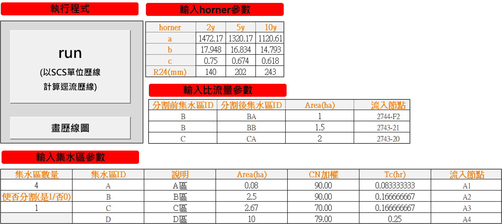
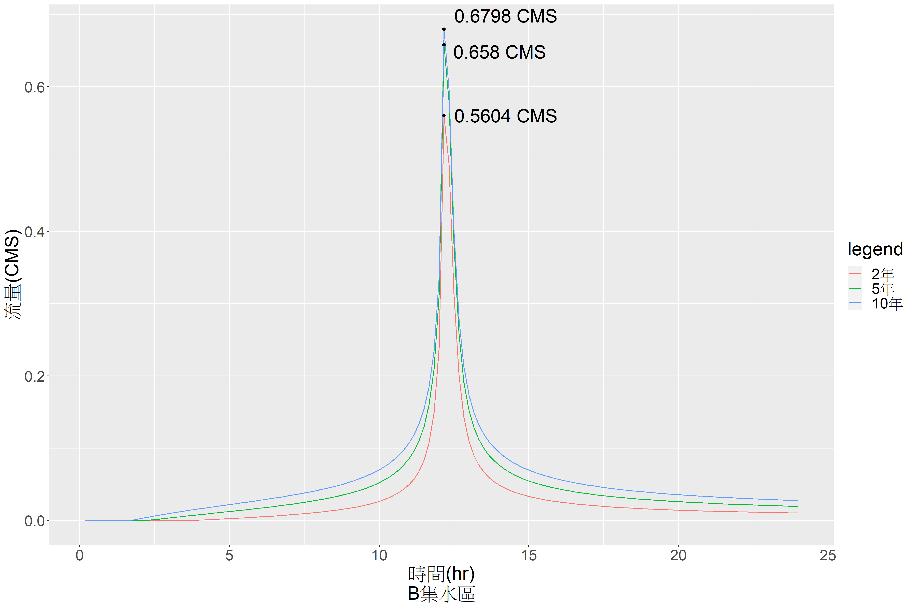
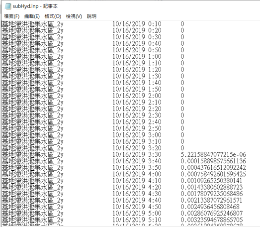
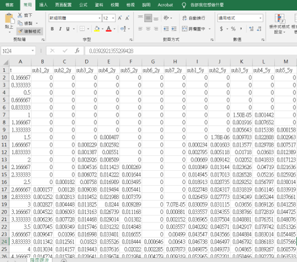

# hydrographSCS 1.0

## 功能簡介
#### 分析複數集水區降雨逕流歷線
輸入集水區雨量、CN值等參數後批次演算多個集水區各重現期的逕流歷線，並可選擇是否進行比流量計算

#### 視覺化計算成果

以折線圖的方式呈現演算過程及成果，包含降雨逕流歷線、單位歷線

#### 輸出報表及SWMM輸入檔

以csv及SWMM輸入檔呈現演算過程及成果
      

## 演算法

#### 設計雨型

以降雨強度-延時 Horner 公式進行雨型設計，雨型單位時間刻度採 10 分鐘，計算24hr交替阻體圖

#### 有效降雨量計算

以美國水土保持局Soil Conservation Service曲線號碼(Curve Number)計算

#### 單位歷線

採美國農業部(United States De-partment of Agriculture)自然資源保護局(Natural Resources Conservation Service)發布之國家工程手冊水文篇(National Engineering Handbook Part 630 Hydrology)之SCS無因次單位歷線

## 使用方法

安裝方式:

1. 安裝R4.0
2. 在電腦環境變數中path新增R的路徑
3. 將"hydrographSCS 1.0"資料夾下載至桌面(資料夾中包含輸入參數範例)
4. 執行畫歷線圖的功能前必須安裝畫歷線圖套件，若無法安裝請手動執行installPackage.R。

使用方式:

1. 執行"hydrographSCS主程式.xlsm"
2. rainfall分頁:填入不同重現期雨量資料，若無R24(24hr最大降雨量)資料可填"-1"程式會依horner公式推估
3. subcatchment分頁:填入集水區參數，請勿以中文命名，或輸入過長的字串
4. 若要以比流量方式分割(或放大)歷線，則於subcatchment分頁中設定，並在separate分頁中填入面積
    若不需要以比流量方式分割(或放大)，則於subcatchment分頁中設定，separate分頁中不需填寫任何資料(有填也不會進行相關計算)
5. times分頁:填入欲在SWMM中模擬的24小時時間序列
6. 於主頁面點擊主頁面按鈕"run"進行演算
    點擊後跳出運算視窗，等運算停止後按enter鍵結束運算(同時檢視運算過程，若計算完成會跳出"calculation  complete")
7. 於主頁面點擊按鈕"畫歷線圖"
    點擊後跳出運算視窗，等運算停止後按enter鍵結束運算
8. 演算結果輸出於output & outputPicture資料夾

## 成果檢視

output資料夾：

1. 集水區名稱_重現期.csv(e.g.A_2y)：特定集水區於特定重現期的降雨逕流歷線演算過程
2. SCSq.csv：單位歷線計算成果
3. 降雨逕流.csv：各集水區降雨於各重現期逕流歷線計算成果
4. 降雨逕流summary：各集水區降雨於各重現期逕流歷線之洪峰流量彙整表

outputPicture資料夾：

1. Hyd資料夾：降雨逕流歷線圖
2. unitHyd資料夾：單位歷線圖